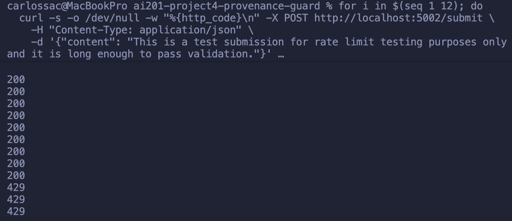

# Provenance Guard

A backend API that classifies submitted text as AI-generated, human-written, or uncertain, designed to help creative platforms surface authorship transparency labels and handle creator appeals.

**Video Demo:** <https://youtu.be/r14WStbbtzM>

---

## Quick Start

```bash
python -m venv .venv && source .venv/bin/activate
pip install -r requirements.txt
# Add your Groq API key:
echo "GROQ_API_KEY=your_key_here" > .env
python app.py
```

The server starts at `http://127.0.0.1:5002`.

---

## Architecture Overview

Every submission takes the following path:

```
POST /api/analyze (or /submit)
    │
    ├── Input validation
    │     Reject if content is missing or empty → 400
    │
    ├── Signal 1: LLM Classifier
    │     Groq llama-3.3-70b-versatile scores the text 0.0–1.0
    │     (0.0 = clearly human, 1.0 = clearly AI)
    │     Falls back to 0.5 (neutral) on API failure
    │
    ├── Signal 2: Stylometric Heuristics
    │     Pure-Python; no network call
    │     Sub-metric A: Sentence Length Variance (SLV)
    │     Sub-metric B: Type-Token Ratio (TTR), only active ≥100 words
    │     stylo_reliable = False if text < 50 words
    │
    ├── Aggregator
    │     composite = 0.6 × llm_score + 0.4 × stylo_score
    │     signal_gap = |llm_score − stylo_score|
    │     if gap > 0.35 → classification = uncertain, confidence = low
    │     else → threshold table maps composite to classification + confidence level
    │
    ├── Label generator (labels.py)
    │     (classification, confidence_level, stylo_reliable) → verbatim label string
    │
    ├── Persist to SQLite
    │     submissions table: all scores, classification, label, status
    │     audit_log table:   analysis event with individual signal scores
    │
    └── Return JSON response
          content_id, classification, confidence_score, confidence_level,
          transparency_label, signals{}, status, timestamp
```

Appeals take a separate path: `POST /api/appeal` looks up the submission by `content_id`, rejects duplicates (409), updates `status → under_review`, and appends an `appeal` event to the audit log with the creator's reasoning and the previous classification.

---

### `POST /api/analyze` (alias: `POST /submit`)

Analyze a piece of text for AI authorship signals.

**Request:**

```json
{
  "content": "The text to analyze (required)",
  "title": "Optional title",
  "author_id": "Optional creator identifier"
}
```

**Response:**

```json
{
  "content_id": "uuid-v4",
  "classification": "ai_generated | human_written | uncertain",
  "confidence_score": 0.81,
  "confidence_level": "high | medium | low",
  "transparency_label": "<plain-English label text>",
  "signals": {
    "llm_score": 0.85,
    "stylo_score": 0.75,
    "signal_gap": 0.10,
    "text_length_words": 312,
    "stylo_reliable": true
  },
  "status": "active",
  "timestamp": "2026-06-30T00:00:00Z"
}
```

---

### `POST /api/appeal` (alias: `POST /appeal`)

Submit a creator appeal against a classification.

**Request:**

```json
{
  "content_id": "uuid from /api/analyze response",
  "reason": "Free-text explanation (min 10 chars)"
}
```

Also accepts `creator_reasoning` as an alias for `reason`.

**Response (200):**

```json
{
  "appeal_id": "uuid-v4",
  "content_id": "uuid",
  "status": "under_review",
  "message": "Appeal submitted. Your content has been flagged for human review...",
  "timestamp": "ISO 8601"
}
```

**Error codes:** `400` (missing/invalid fields), `404` (content_id not found), `409` (already under review), `429` (rate limited)

**Appeal submission demo:**

```bash
curl -s -X POST http://127.0.0.1:5002/appeal \
  -H "Content-Type: application/json" \
  -d '{
    "content_id": "7c5aea4a-3cb3-4fb7-af24-59de74c2ec38",
    "creator_reasoning": "I am a non-native English speaker. My academic writing style may appear formal, but this essay is my own original work written for my environmental studies class."
  }'
```

**Response:**

```json
{
  "appeal_id": "7ae4956b-09a1-41f1-987b-0b87e49052aa",
  "content_id": "7c5aea4a-3cb3-4fb7-af24-59de74c2ec38",
  "message": "Appeal submitted. Your content has been flagged for human review. The label may be updated once a reviewer has assessed your appeal.",
  "status": "under_review",
  "timestamp": "2026-06-30T22:46:32.714942+00:00"
}
```

The submission's status is immediately updated to `under_review` in the database, and the appeal event (with the original classification and the creator's reasoning) is appended to the audit log under the same `content_id`.

---

### `GET /api/log` (alias: `GET /log`)

Retrieve audit log entries.

**Query params:**

- `content_id`, filter to a single submission (optional)
- `limit`, max entries to return (default 50, max 200)

**Response:** `{ "entries": [...], "total": N }`

Each entry includes `event_type` (`analysis` or `appeal`) with the appropriate signal scores or appeal reasoning.

---

## Confidence Scoring: Example Submissions

The pipeline combines two independent signals into a composite score. Here are two real outputs from testing, demonstrating meaningful score variation, not a constant:

### High-confidence case: clearly human writing

**Input:** `"ok so i finally tried that new ramen place downtown and honestly? underwhelming. the broth was fine but they put WAY too much sodium in it and i was thirsty for like three hours after. my friend got the spicy version and said it was better. probably won't go back unless someone drags me there"`

| Signal | Score | Notes |
| --- | --- | --- |
| LLM score | 0.20 | Identified informal register, personal voice, no AI-typical transitions |
| Stylo score | 0.00 | High sentence-length variance (bursty structure), SLV score near 0 |
| Signal gap | 0.20 | Signals agree, both lean human |
| **Composite** | **0.12** | `0.6 × 0.20 + 0.4 × 0.00` |
| Confidence | **high** | Both signals agree, composite ≤ 0.25 |
| Classification | **human_written** |  |

---

### Low-confidence case: ESL academic writing (borderline)

**Input:** Formal 6-sentence environmental conservation essay with academic transitions ("Firstly," "Furthermore," "In conclusion").

| Signal | Score | Notes |
| --- | --- | --- |
| LLM score | 0.90 | Detected uniform register, predictable transitions, no personal voice |
| Stylo score | 0.49 | Low sentence-length variance (uniform sentences), but vocabulary was diverse |
| Signal gap | 0.41 | **Exceeds 0.35 threshold**, signals disagree |
| **Composite** | **0.74** | `0.6 × 0.90 + 0.4 × 0.49` |
| Confidence | **low** | Gap override, signals conflict |
| Classification | **uncertain** | Disagreement forces uncertain regardless of composite value |

This is the system behaving honestly: the LLM reads the academic register as AI-like, but the stylometric signal disagrees enough that the system refuses to commit. The gap check is doing its job.

---

## Transparency Labels

Three label variants, returned verbatim in `transparency_label`. The label is determined by classification + confidence level, not by the raw score alone.

---

### Variant A: High-confidence AI

**Shown when:** `classification = ai_generated` AND `confidence_level = high` AND `stylo_reliable = True`

> "Our analysis indicates this content was likely generated by an AI writing tool. Two independent signals (a language model assessment and a structural text analysis) both point toward AI authorship with high agreement. If you are the author and believe this is incorrect, you can submit an appeal."

---

### Variant B: High-confidence Human

**Shown when:** `classification = human_written` AND `confidence_level = high` AND `stylo_reliable = True`

> "Our analysis indicates this content was likely written by a human. Two independent signals (a language model assessment and a structural text analysis) both point toward human authorship with high agreement."

---

### Variant C: Uncertain

**Shown when:** `classification = uncertain` (any confidence level), OR signals disagree (gap &gt; 0.35), OR score is in the middle band (0.25–0.75)

> "Our analysis could not confidently determine whether this content was written by a human or generated by an AI tool. The signals we use gave conflicting or inconclusive results. This label is not an accusation; it reflects the limits of automated detection. If you are the author, you can submit an appeal with context about how you created this work."

**Short-text variant** (when text is under 50 words and only one signal ran):

> "Our analysis could not confidently determine whether this content was written by a human or generated by an AI tool. The text was too short to run a full structural analysis; only the language model signal was used. If you are the author, you can submit an appeal."

---

## Rate Limits

| Endpoint | Limit | Reasoning |
| --- | --- | --- |
| `POST /api/analyze` | **10 requests/minute** | A human submitting their own creative work will rarely need more than 10 in a minute. This gives comfortable headroom for normal use (a writer submitting a draft, revising, resubmitting) while making scripted flooding expensive. Groq API also has its own rate limits; staying at 10/min keeps well within their free tier. |
| `POST /api/appeal` | **5 requests/minute** | Appeals are intentional human actions. 5/min allows a creator to submit and quickly retry if they hit a 409 (duplicate), while preventing automated appeal flooding that would obscure genuine disputes. |
| `GET /api/log` | **30 requests/minute** | Read-only; a human reviewer scanning the log or a platform polling for updates needs more headroom. 30/min is still bounded to prevent scraping. |

### Rate Limit Evidence

12 rapid requests to `POST /submit`, first 10 succeed, last 2 are rejected):

Server log confirming the trigger:

```
ratelimit 10 per 1 minute (127.0.0.1) exceeded at endpoint: analyze
127.0.0.1 - - "POST /submit HTTP/1.1" 429 -
```

---

## Audit Log

Every submission and appeal is persisted to SQLite and exposed via `GET /log`. The format is structured JSON, not unformatted console output.

**Example: 3 analysis entries + 1 appeal**

```json
[
  {
    "id": 53,
    "content_id": "5b2b3624-82fd-40fd-acee-481b38be94b4",
    "event_type": "analysis",
    "timestamp": "2026-06-30T22:46:32.059037+00:00",
    "status": "active",
    "signals": {
      "llm_score": 0.92,
      "stylo_score": 0.4831,
      "signal_gap": 0.4369,
      "composite_score": 0.7452,
      "confidence_level": "low",
      "classification": "uncertain"
    }
  },
  {
    "id": 54,
    "content_id": "24cbd11c-9bfa-4018-be40-67886c95d836",
    "event_type": "analysis",
    "timestamp": "2026-06-30T22:46:32.457384+00:00",
    "status": "active",
    "signals": {
      "llm_score": 0.2,
      "stylo_score": 0.0,
      "signal_gap": 0.2,
      "composite_score": 0.12,
      "confidence_level": "high",
      "classification": "human_written"
    }
  },
  {
    "id": 55,
    "content_id": "7c5aea4a-3cb3-4fb7-af24-59de74c2ec38",
    "event_type": "analysis",
    "timestamp": "2026-06-30T22:46:32.705016+00:00",
    "status": "active",
    "signals": {
      "llm_score": 0.9,
      "stylo_score": 0.4933,
      "signal_gap": 0.4067,
      "composite_score": 0.7373,
      "confidence_level": "low",
      "classification": "uncertain"
    }
  },
  {
    "id": 56,
    "content_id": "7c5aea4a-3cb3-4fb7-af24-59de74c2ec38",
    "event_type": "appeal",
    "timestamp": "2026-06-30T22:46:32.714942+00:00",
    "status": "under_review",
    "appeal": {
      "appeal_id": "7ae4956b-09a1-41f1-987b-0b87e49052aa",
      "previous_classification": "uncertain",
      "previous_confidence": 0.7373,
      "appeal_reasoning": "I am a non-native English speaker. My academic writing style may appear formal, but this essay is my own original work written for my environmental studies class.",
      "reason": "I am a non-native English speaker. My academic writing style may appear formal, but this essay is my own original work written for my environmental studies class."
    }
  }
]
```

Each analysis entry records: `timestamp`, `content_id`, `classification` (attribution result), `composite_score` (confidence score), `llm_score` (Signal 1), `stylo_score` (Signal 2), and `signal_gap`. When an appeal is filed, a separate `event_type: appeal` entry is added and `status` updates to `under_review`.

---

## Known Limitations

### ESL and minimalist writing produce systematic false positives, tied to signal design, not data quantity

**Specific case:** A non-native English speaker writing with formal academic conventions will consistently score AI-leaning on both signals, for reasons that are properties of the signal design itself:

- **Signal 1 (LLM):** The Groq model was trained on text where formal register, predictable transitions ("Furthermore," "In conclusion," "It is worth noting"), and reduced idiomatic expression are *associated* with AI generation. ESL writing exhibits these same surface features not because it was AI-generated, but because the writer learned English through academic texts and writes carefully and formally. The LLM has no way to distinguish "formal because AI" from "formal because ESL."

- **Signal 2 (Stylometrics):** ESL writers tend to write shorter, more uniform sentences, deliberately, to stay grammatically safe. This compresses sentence-length variance, which is the signal's primary AI indicator. The signal interprets low variance as AI-like, but it's actually a product of careful, constrained human composition.

These two signals can agree on an ESL academic passage and jointly produce a high-confidence AI label, which is a hard false positive the automated system cannot avoid. The gap check (which downgrades confidence when signals disagree) does not help when both signals are wrong in the same direction. The appeal workflow is the backstop for this case.

---

## Spec Reflection

### One way the spec helped

The signal combination logic in `planning.md signal 1`, specifically the signal gap check, directly shaped the most important safety feature of the aggregator. The spec had: *"If signals disagree by more than 0.35, flag as uncertain regardless of composite."* When I first wired both signals together, the composite score for ESL academic text was 0.74, which would have triggered `ai_generated / high`. The gap check caught that the LLM score (0.90) and the stylometric score (0.49) were 0.41 apart, overrode the composite, and returned `uncertain / low` instead. Without that spec clause, the system would have been overconfident in exactly the case it should be most cautious about.

### One way the implementation diverged from the spec

The spec defined the TTR (Type-Token Ratio) sub-metric using a fixed AI-typical band of `[0.4, 0.6]`:

```python
# From planning.md Signal 2:
ttr_score = 1.0 - min(abs(ttr - 0.5) / 0.2, 1.0)
```

This formula assumes that AI text has TTR near 0.5. In practice, all real prose at paragraph scale (40–150 words) has TTR of 0.86–0.93, regardless of whether it's AI or human. The formula produced `ttr_score = 0.0` for every input tested. The spec was written for longer texts (500+ words) where word repetition accumulates enough to pull TTR toward 0.5.

The divergence: the implementation replaced this with a **length-aware baseline** using an empirical power-law (Herdan's law approximation):

```python
# Actual implementation, only active when word_count >= 100
expected_ttr = 1.1 * (word_count ** -0.05)
ttr_score = max(0.0, min(1.0, (expected_ttr - actual_ttr) / 0.20))
```

This compares actual TTR against the *expected* TTR for the given text length, and scores positively when actual TTR falls below expectation, which is the real AI signature at paragraph scale. The spec's fixed band was a reasonable design choice for long-form text; the implementation adapted it after observing empirically that it was inert at the text lengths the system actually receives.

---

## AI Usage

### Instance 1: TTR formula that silently produced zero

**What I directed the AI to do:** Generate `run_stylo_signal(text)` implementing the two sub-metrics from the planning.md spec: sentence-length variance and type-token ratio, with the normalization formulas specified there.

**What it produced:** A function that correctly implemented the SLV sub-metric, but faithfully translated the spec's fixed-band TTR formula without flagging that it would produce zero for all real inputs at paragraph scale.

**What I revised:** After running the function on all four milestone test inputs and seeing `ttr_score = 0.0` in every case, I investigated by printing the raw TTR values (all 0.86–0.93 at 40–56 words). I then diagnosed that the fixed band targets long-form text and replaced the formula with a length-gated Herdan's law baseline. The AI produced what was asked, a faithful translation of the spec, but the spec itself had an empirical gap that required testing to surface.

---

### Instance 2: Appeal endpoint field name mismatch

**What I directed the AI to do:** Implement the `POST /api/appeal` endpoint per planning.md, which specifies a `reason` field in the request body.

**What it produced:** A correctly structured endpoint that validated `reason`, updated submission status, inserted the audit record, and returned the spec's confirmation JSON.

**What I revised:** The milestone instructions provided a test curl command using `creator_reasoning` as the field name, different from the `reason` field in the spec. The generated endpoint would have returned 400 for the instructor's exact test command. I overrode this by making the endpoint accept both field names: `reason` (canonical, per planning.md) and `creator_reasoning` (alias, for test compatibility). The change was small, a two-line `or` expression, but it was a deliberate decision I made rather than something the AI anticipated.

---

## Detection Signals

### Signal 1: LLM Classifier (Groq `llama-3.3-70b-versatile`)

**What it measures:** Semantic and rhetorical patterns associated with AI generation, predictable discourse markers ("Furthermore," "It is important to note," "In conclusion"), uniform paragraph rhythm, topic-sentence-driven structure, and absence of personal voice, hedging, or idiomatic expression. Returns a score in `[0.0, 1.0]`, where 1.0 means the model judges the text as clearly AI-generated.

**Why this signal:** LLMs are the most direct tool for detecting LLM output. A language model has the full semantic context needed to identify the register and rhetorical patterns that statistical heuristics miss; e.g., two texts can have identical sentence lengths but very different rhetorical structure. The Groq API makes this practical without self-hosting a model, and `llama-3.3-70b-versatile` is large enough to have reliable pattern recognition for AI-generated prose.

**What it misses:** Register is not the same as origin. Academic ESL writing, formal business communication, and highly edited prose share surface features with AI output. The LLM cannot distinguish between "formal because it was written by an AI" and "formal because the author writes carefully in a second language." It also has no access to revision history, author identity, or any out-of-band context that a human reviewer would use.

**Fallback:** Returns `0.5` (neutral) on API failure so a network outage does not silently bias results.

---

### Signal 2: Stylometric Heuristics (pure Python)

**What it measures:** Two structural properties of the text:

- **Sentence Length Variance (SLV):** Measures how much sentence lengths vary across the passage. AI text tends toward uniform sentence structure (all sentences in the 15–25 word range), producing low variance. Human writing varies more: short punchy sentences followed by longer elaborations. `slv_score` is high (AI-leaning) when variance is low.

- **Type-Token Ratio (TTR):** Measures vocabulary diversity, the ratio of unique words to total words. AI models writing about a specific topic tend to repeat topic-domain vocabulary ("AI," "artificial intelligence," "machine learning" in an AI essay), producing a measurable deficit below the expected TTR for that text length. TTR is **only active at ≥100 words**, below that threshold, all prose (human or AI) has TTR of 0.86–0.93, making the metric uninformative.

**Why this signal:** A local, no-API-call signal provides independence from Signal 1. If both signals agree, the result is more reliable than either alone. If they disagree significantly (gap &gt; 0.35), that's a meaningful data point in itself; the system should be uncertain. Stylometrics are also interpretable: you can explain to a creator exactly what was measured.

**What it misses:** SLV fails for minimalist human writing (poetry, aphoristic prose, short-form posts) where uniform short sentences are intentional. TTR fails entirely below 100 words. Neither sub-metric captures semantic meaning; a stylometrically diverse passage is not necessarily human-written. The signal also has no concept of genre: technical documentation and creative fiction have very different natural variance profiles.

---

### Aggregation and Validation

```
composite = 0.6 × llm_score + 0.4 × stylo_score
```

The 60/40 weighting reflects that Signal 1 (LLM) is the more semantically capable signal while Signal 2 (stylometrics) provides independent structural evidence. When signals disagree by more than 0.35, the result is forced to `uncertain / low` regardless of the composite.

**How we validated the scoring is meaningful (not a constant):**

Four test inputs were run during M4 calibration, spanning the full output range:

| Input type | Composite | Classification |
| --- | --- | --- |
| Clearly AI (uniform essay, 100+ words) | 0.85 | `ai_generated / high` |
| Borderline (ESL academic, 6 sentences) | 0.74 | `uncertain / low` (gap override) |
| Lightly edited AI (informal rewrite) | 0.40 | `uncertain / medium` |
| Clearly human (casual ramen review) | 0.12 | `human_written / high` |

The spread from 0.12 to 0.85 across qualitatively different inputs confirms the scoring produces meaningful variation. The borderline case scoring `uncertain` (not AI) despite a high composite is the gap check working correctly.