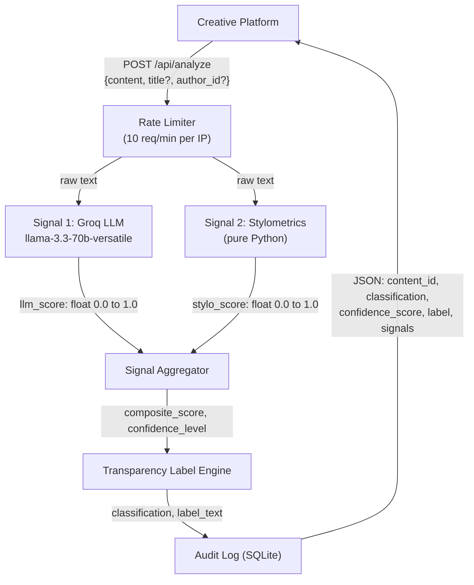
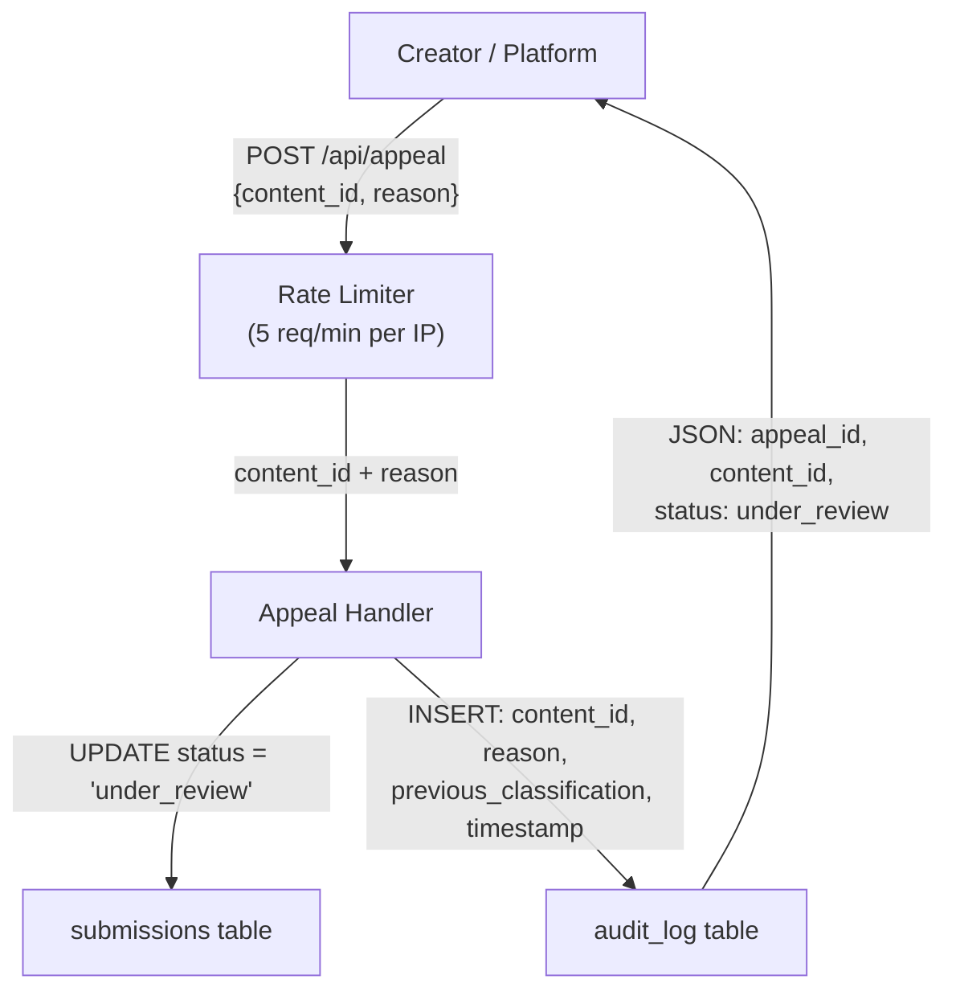

# Provenance Guard: Planning Document

## Project Overview

Platforms where people share original creative work (writing, music, art) are facing a new challenge: how do you know whether what someone posted was made by them, or generated by AI and passed off as human? Not to police creativity, but to protect attribution, build trust, and give audiences the context they actually need.

Provenance Guard is a backend system that any creative sharing platform could plug into to classify submitted content, score confidence in that classification, surface a transparency label to users, and handle appeals from creators who believe they've been misclassified.

---

## Tech Stack

| Component | Tool |
| --- | --- |
| API framework | Flask |
| Detection signal 1 | Groq (`llama-3.3-70b-versatile`) |
| Detection signal 2 | Stylometric heuristics |
| Rate limiting | Flask-Limiter |
| Audit log | SQLite (built-in) |

---

## Architecture

Two flows drive the system. Every other design decision below flows from these.

### Flow 1: Content Submission



### Flow 2: Creator Appeal



**Submission flow:** A piece of text arrives at `POST /api/analyze`, passes through the rate limiter, and is evaluated in parallel by two independent signals: an LLM-based semantic assessor (Groq) and a pure-Python stylometric heuristics engine. Their scores are weighted and combined into a composite score, which the Transparency Label Engine maps to one of three plain-language label variants; the full result is then persisted to the SQLite audit log and returned as JSON.

**Appeal flow:** A creator who disputes a classification calls `POST /api/appeal` with their `content_id` and a written explanation; the system immediately updates the submission's status to `under_review` in the database, inserts a structured appeal record into the audit log alongside the original detection data, and returns a confirmation; no automated re-classification occurs.

---

## 1. Detection Signals

### Signal 1: LLM Classifier (Groq `llama-3.3-70b-versatile`)

The LLM classifier measures Holistic semantic patterns, specifically whether the text reads like output from a language model. The LLM is prompted to evaluate: predictable transition phrases ("moreover", "it is worth noting", "delve into"), uniform paragraph rhythm, absence of personal voice or contradiction, and overly resolved conclusions. These are hallmarks of token-prediction generation, not human drafting.

**Output format:** A single float, `llm_score`, in the range `[0.0, 1.0]`.

- `0.0` = confident this is human writing
- `1.0` = confident this is AI-generated

The LLM is prompted to return a JSON object `{"score": 0.XX, "reasoning": "..."}`. The `reasoning` field is stored in the audit log but not exposed in the API response. If the LLM returns a malformed response or non-numeric score, the system falls back to `0.5` (neutral) and logs the failure.

**Prompt structure (sent to Groq):**

```
You are an AI authorship detection expert. Analyze the following text and return a JSON object with:
- "score": a float from 0.0 (clearly human-written) to 1.0 (clearly AI-generated)
- "reasoning": one sentence explaining your assessment

Focus on: predictable phrasing, uniform sentence rhythm, AI-typical transitions, absence of personal voice.
Do not factor in topic or subject matter; focus only on writing style and structure.

TEXT:
{content}

Respond with only valid JSON. No explanation outside the JSON object.
```

---

### Signal 2: Stylometric Heuristics (pure Python)

**What it measures:** Statistical properties of sentence structure and vocabulary that differ systematically between human and AI writing. Two sub-metrics are computed and combined:

| Sub-metric | What it captures | AI signature | Human signature |
| --- | --- | --- | --- |
| **Sentence Length Variance** | Structural "burstiness" | Low variance (uniform length) | High variance (short + long sentences mixed) |
| **Type-Token Ratio (TTR)** | Vocabulary diversity | Moderate-high, artificially consistent | Variable; often lower in casual writing, higher in literary |

---

## 2. Uncertainty Representation

### What a score of 0.6 means

A composite score of `0.6` means: the weighted signal combination leans AI-generated, but not strongly. The LLM might score it `0.65` and stylometrics score it `0.52`. This is the range where the system has a directional lean but not enough evidence to assert high confidence. Showing "AI-generated" at 0.6 to a non-technical user would be misleading, as it implies a certainty the data doesn't support.

**Thresholds:**

- **AI confident zone:** composite ≥ 0.75 AND signals agree (gap ≤ 0.35)
- **Human confident zone:** composite ≤ 0.25 AND signals agree (gap ≤ 0.35)
- **Uncertain zone:** everything else: the middle band OR any disagreement between signals

### Confidence score in the API response

The API returns `confidence_score` as the raw composite float, not a category. The label variant is determined by the mapping table above. This lets consuming platforms display "62% confidence" if they want, while the label text handles the interpretation for non-technical readers.

---

## 3. Transparency Labels

These are the exact strings the system produces. The `label_text` field in the API response will contain verbatim one of these three variants.

### Variant A: High-Confidence AI

> "Our analysis indicates this content was likely generated by an AI writing tool. Two independent signals (a language model assessment and a structural text analysis) both point toward AI authorship with high agreement. If you are the author and believe this is incorrect, you can submit an appeal."

**Shown when:** `classification = ai_generated` AND `confidence_level = high`

---

### Variant B: High-Confidence Human

> "Our analysis indicates this content was likely written by a human. Two independent signals (a language model assessment and a structural text analysis) both point toward human authorship with high agreement."

**Shown when:** `classification = human_written` AND `confidence_level = high`

---

### Variant C: Uncertain

> "Our analysis could not confidently determine whether this content was written by a human or generated by an AI tool. The signals we use gave conflicting or inconclusive results. This label is not an accusation; it reflects the limits of automated detection. If you are the author, you can submit an appeal with context about how you created this work."

**Shown when:** `classification = uncertain` (any `confidence_level`)

---

### Label display rules

- All three variants are plain English.
- The `confidence_score` float is exposed separately in the API; the label text does not include the raw number (e.g., "62%").
- Platforms may display the score alongside the label if they choose; the label text stands on its own.

---

## 4. Appeals Workflow

### Who can appeal

Any creator whose content has received a classification. The appeal endpoint is not authenticated in the MVP; the caller must supply a valid `content_id`. In production, this would be gated by the platform's auth layer.

### What they provide

The `reason` field is unstructured on purpose. Creators might explain: that they wrote in a second language, that their style is deliberately minimal, that they have draft history, or that they use AI tools as an editor but wrote the original. All of this is useful context for a human reviewer.

### What the system does on receipt

1. **Validate** that `content_id` exists in the `submissions` table. Return 404 if not found.
2. **Check current status.** If status is already `under_review`, return 409, no duplicate appeals.
3. **Update** `submissions.status` from `active` → `under_review`.
4. **Insert** a new row into `audit_log`:


5) **Return** to the caller:

### What a human reviewer sees (GET /api/log)

When a moderator queries `GET /api/log`, they see both log entries side by side:

1. The original `analysis` event, with `llm_score`, `stylo_score`, `composite_score`, `label_text`, and `confidence_level`
2. The subsequent `appeal` event, with the creator's `reason`, the timestamp, and `previous_classification`

This gives a reviewer the full picture: what the system decided, how confident it was, why each signal scored the way it did, and what the creator says in response.

---

## 5. Anticipated Edge Cases

### Edge Case 1: Minimalist or repetition-heavy poetry

**Scenario:** A poet writes a spare, Imagist-style poem using short, uniform lines and simple vocabulary (e.g., inspired by William Carlos Williams or haiku). Every sentence is 3 to 7 words. The Type-Token Ratio is low because the poem repeats specific words deliberately. Sentence length variance is near zero by design.

**What goes wrong:** The stylometric signal scores this as AI-generated (`stylo_score ≈ 0.80`) because the statistical profile matches AI uniformity. The LLM signal may partially save it if the semantic content reads as distinctly human, but if the poem is abstract enough, the LLM may also score it as uncertain.

**Mitigation:** The signal divergence check helps only if the LLM reads it as human. If both signals agree (incorrectly), the system will produce a high-confidence AI result, a false positive. The transparent label and appeal workflow are the backstop: the uncertain or AI label explicitly invites the creator to contest it.

---

### Edge Case 2: ESL academic writing

**Scenario:** A graduate student writing in English as their second language submits a short story. Their sentence structures are formal and regular, they use transitional phrases from academic writing conventions ("Furthermore", "In conclusion", "It is important to note"), and their vocabulary is deliberately careful rather than idiomatic.

**What goes wrong:** Both signals may independently score this as AI-generated. The LLM signal picks up on the formal transition phrases and uniform register. The stylometric signal sees moderate sentence length variance and predictable vocabulary diversity. Composite score lands around 0.70 to 0.78, which is right in the high-confidence AI zone.

**Mitigation:** This is a hard false positive that the automated system cannot fully avoid. The appeal workflow must carry the weight here: the label explicitly says "this is not an accusation" and directs creators to appeal. The `reason` field in the appeal lets them explain their ESL context, which a human reviewer can verify.

---

### Edge Case 3: AI-assisted editing of human draft

**Scenario:** A writer drafts a blog post, then uses an AI tool to copyedit for grammar and flow. The ideas and structure are human; the final prose is AI-polished. The resulting text has human-generated content architecture but AI-smoothed sentence-level delivery.

**What goes wrong:** This is an ambiguous case: neither "AI-generated" nor "human-written" is entirely accurate. The LLM signal will likely detect the AI polish (score ≈ 0.55 to 0.65). The stylometric signal may come in lower if the human's original structure still shows variance (score ≈ 0.40 to 0.55). Composite ≈ 0.50 to 0.60, landing in the Uncertain zone.

**Why this is actually the right outcome:** The Uncertain label is the honest answer here. The system correctly identifies that attribution is ambiguous rather than forcing a binary it can't support. This is by design: the Uncertain zone exists precisely for co-creation scenarios where the human/AI boundary is real but blurry.

---

## 6. Rate Limiting

| Endpoint | Limit | Reasoning |
| --- | --- | --- |
| `POST /api/analyze` | 10 requests/minute per IP | Groq API has rate limits; one submission is \~1 to 2 API calls. 10/min gives headroom for a legitimate burst without enabling scraping or DoS. |
| `POST /api/appeal` | 5 requests/minute per IP | Appeals are intentional human actions; 5/min prevents automated appeal flooding while allowing a creator to resubmit if they hit a 409. |
| `GET /api/log` | 30 requests/minute per IP | Read-only; higher limit is fine, but should still be bounded. |

---

## AI Tool Plan

This section defines exactly what context to given to the AI code-generation tool (Claude) at each milestone, what to ask for, and how to verify the output before moving forward. The architecture diagram and relevant spec sections should be given with each prompt.

---

### M3: Submission Endpoint + Signal 1 (Groq LLM)

**Spec sections to provide:**

- `## Architecture` (both Mermaid diagrams + narrative)
- `## 1. Detection Signals`: Signal 1 subsection only (Groq prompt text, output format, fallback behavior)

**What to ask the AI tool to generate:**

> "Using the architecture diagram and spec below, generate: (1) `app.py`, a Flask app skeleton with a `POST /api/analyze` route that validates the request body and returns a stub response; (2) `database.py`, SQLite init and insert helpers for the `submissions` and `audit_log` tables; (3) a `run_llm_signal(text)` function in `pipeline.py` that sends the prompt to Groq using the `groq` Python library and returns `llm_score` as a float with a 0.5 fallback on failure. Do not implement Signal 2 or scoring yet."

**Verification before wiring into endpoint:**

1. Call `run_llm_signal()` directly with a known AI-generated paragraph, expect score ≥ 0.65.
2. Call it with a clearly human passage (personal anecdote, idiosyncratic phrasing), expect score ≤ 0.45.
3. Call it with an empty string or garbage input, confirm it returns `0.5` without raising an exception.
4. Check the raw Groq response is valid JSON with `score` and `reasoning` keys before accepting the output.

---

### M4: Signal 2 (Stylometrics) + Confidence Scoring

**Spec sections to provide:**

- `## Architecture` (both diagrams + narrative)
- `## 1. Detection Signals`: Signal 2 subsection (both sub-metrics with normalization formulas, minimum text length check)
- `## 1. Detection Signals`: Signal Combination block (reliability checks, weighting logic, signal gap check)
- `## 2. Uncertainty Representation`

**What to ask the AI tool to generate:**

> "Using the spec below, generate: (1) a `run_stylo_signal(text)` function in `pipeline.py` that computes sentence length variance and TTR, normalizes each to \[0,1\] per the formulas in the spec, and returns `stylo_score` as a float; (2) an `aggregate_signals(text, llm_score, stylo_score)` function that checks if the text is at least 50 words to determine `stylo_reliable`, applies the weighted combination formula and signal gap check from the spec, and returns `composite_score`, `confidence_level`, and `classification`."

**Verification: do scores vary meaningfully?**

1. Run both signals on a GPT-generated paragraph: expect `composite_score` &gt;= 0.72 and `confidence_level = 'high'`.
2. Run both signals on a stream-of-consciousness human passage: expect `composite_score` &lt;= 0.35 and `confidence_level = 'high'`.
3. Run on a very short text (under 50 words): verify it bypasses stylometrics, returns `stylo_reliable = False`, and sets `composite_score` to the `llm_score` with `confidence_level = 'medium'`.
4. Run on an ESL academic paragraph: expect result in the uncertain band to validate the edge case from Section 5.

---

### M5: Production Layer (Labels + Appeals + Audit Log)

**Spec sections to provide:**

- `## Architecture` (both diagrams + narrative)
- `## 3. Transparency Labels` (all three verbatim label variants + display rules)
- `## 4. Appeals Workflow` (who can appeal, request fields, status changes, exact audit log record structure, reviewer view)
- `## 6. Rate Limiting` 

**What to ask the AI tool to generate:**

> "Using the spec below, generate: (1) `labels.py`, a `generate_label(classification, confidence_level)` function that returns exactly one of the three verbatim label strings defined in the spec; (2) a `POST /api/appeal` route in `app.py` that validates fields, checks for 404/409, updates submission status, inserts the appeal audit record, and returns the specified JSON; (3) a `GET /api/log` route that queries both tables and returns paginated entries with `event_type` distinguishing analysis from appeal events."

**Verification: all three label variants reachable and appeal flow correct:**

1. Call `generate_label('ai_generated', 'high')`, confirm it returns Variant A verbatim.
2. Call `generate_label('human_written', 'high')`, confirm Variant B verbatim.
3. Call `generate_label('uncertain', 'low')`, confirm Variant C verbatim.
4. Call `POST /api/appeal` again with the same `content_id`, confirm 409 is returned.